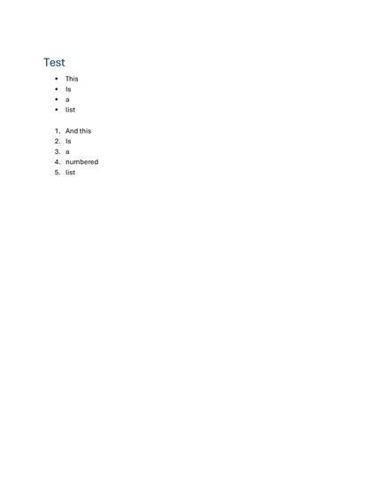
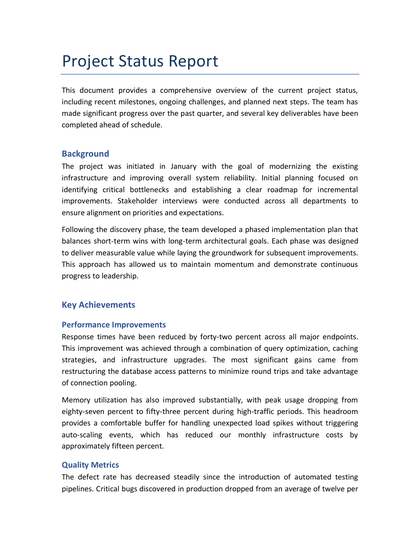
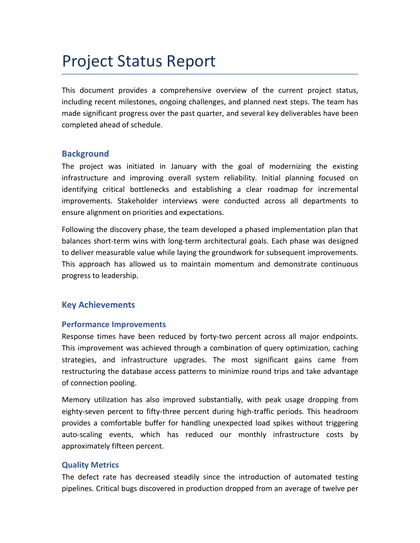
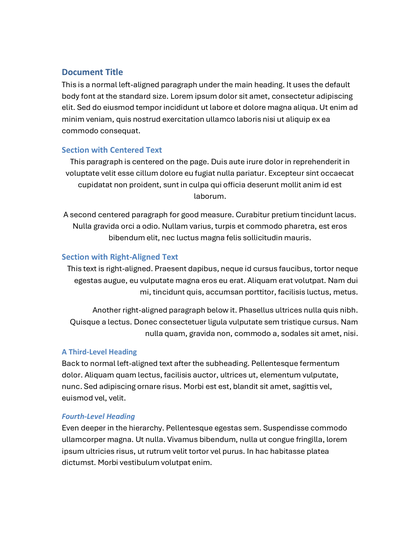
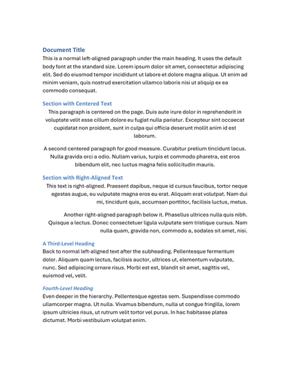
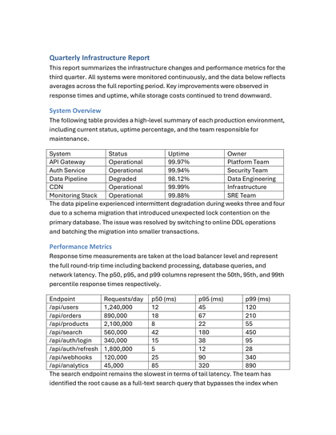
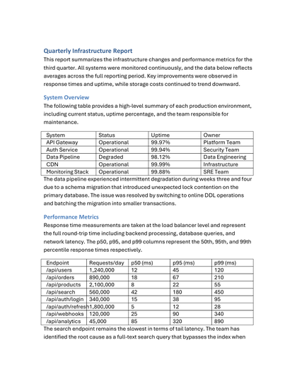
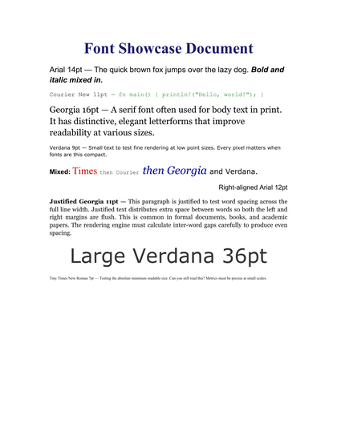
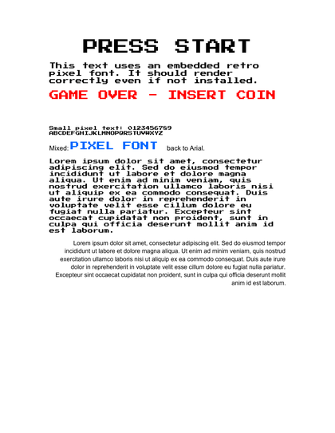
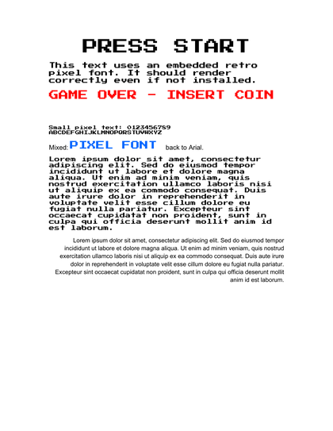

# All test cases

Reference (MS Word) on the left, docxside-pdf on the right.

## case1 — 61.2% SSIM

 

## case2 — 93.3% SSIM

 

## case3 — 88.1% SSIM

 

## case4 — 89.5% SSIM

 

## case5 — 49.9% SSIM

 

## case6 — 54.8% SSIM

 

## case7 — 91.7% SSIM

 

## case8 — 94.1% SSIM

 

## case9 — 90.1% SSIM

 
